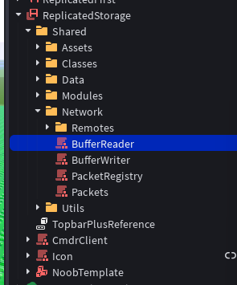
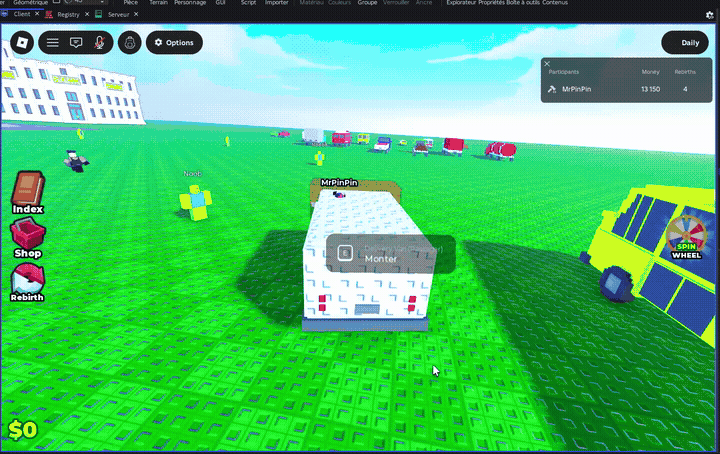
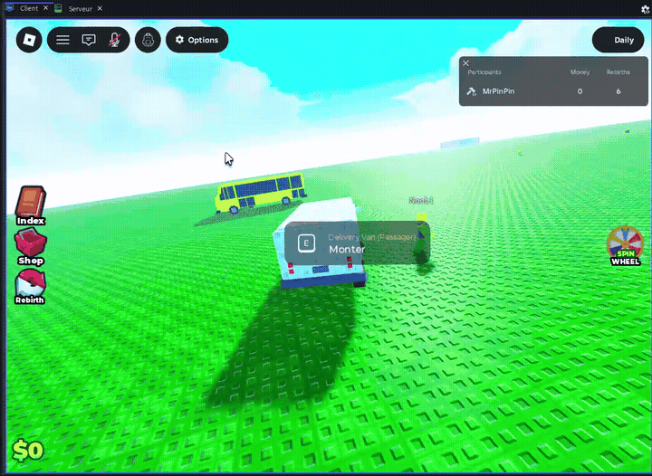

<div align="center">

# MrPinPin — Lead Systems Engineer & Luau OOP Architect
### High-Performance Roblox Infrastructure & Game Engineering

[](https://luau-lang.org/)
[](https://roblox.com)
[](https://create.roblox.com/docs/reference/engine/libraries/buffer)
[](https://discord.gg/hiddendevs)

<p align="center">
  <b>Production-grade systems, clean decoupled architecture, and optimized binary networking.</b><br>
  Focused on scalable backends, low-latency client-server synchronization, and structured OOP codebases for high-traffic Roblox titles.
</p>

[Architecture & Hierarchy](#-project-architecture--clean-hierarchy) • [Binary Buffer Networking](#-binary-buffer-networking-oop) • [In-Engine Gameplay](#-in-engine-gameplay--systems) • [Code Standards](#-code-quality--security-standards) • [Contact](#-contact--references)

---

</div>

## 📌 Executive Summary

- **Object-Oriented Programming (OOP)** : Strict metatable encapsulation with nominal types (`--!strict`), explicit memory cleanup (`:Destroy()`), and state-driven lifecycle management.
- **Binary Network Serialization** : In-house packet serializer using Luau's native `buffer` API — achieving over **70% bandwidth reduction** compared to standard `RemoteEvent` data replication.
- **Enterprise Project Organization** : Modular, clean hierarchy structured under `ReplicatedStorage.Shared`, fully decoupled to prevent cyclic module dependencies and enforce DRY principles.
- **Combat & Movement Feel** : Responsive client-predicted physics, authoritative server validation, dynamic cameras, and fluid animation state machines.

---

## 📂 Project Architecture & Clean Hierarchy

A clean, predictable project structure is paramount for team collaboration and long-term maintainability. Below is the production directory layout used across current projects:

<div align="center">
  
  <br>
  <em>Figure 1: Modular distribution under <code>ReplicatedStorage.Shared</code></em>
</div>

<br>

```text
ReplicatedStorage/
└── Shared/
    ├── Assets/            # Models, VFX configurations, animations, sound templates
    ├── Classes/           # Concrete OOP classes (Entity, Weapon, Inventory, StateMachine)
    ├── Data/              # Immutable game balance configs, item tables, level tiers
    ├── Modules/           # Reusable service singletons, signal emitters, promise wrappers
    ├── Network/           # Custom low-overhead binary networking suite
    │   ├── Remotes/       # Declared RemoteFunction and UnreliableRemoteEvent instances
    │   ├── BufferReader   # OOP Binary deserializer with sequential byte-cursor
    │   ├── BufferWriter   # Dynamic OOP serialization with automatic buffer re-allocation
    │   ├── PacketRegistry # Protocol opcode dictionary and schema validators
    │   └── Packets/       # Typed packet contracts (InputPacket, ReplicationPacket...)
    └── Utils/             # Math libraries, spring interpolators, spatial query helpers
```

### Key Architectural Strengths
- **Separation of Concerns** : Data definitions (`Shared.Data`) are strictly isolated from operational logic (`Shared.Classes`).
- **Single Source of Truth** : Shared components are authored once and queried seamlessly by both server services and client controllers.
- **Modular Expansion** : New gameplay features can be introduced as self-contained classes without affecting core replication loops.

---

## ⚡ Binary Buffer Networking (OOP)

To minimize network throttling and server tick latency on high-frequency replication (such as projectile hits, directional vectors, and rapid player actions), communications bypass raw table remotes in favor of compacted binary byte streams.

### 1. `BufferReader.luau` (High-Speed Deserializer)

```lua
--!strict

export type BufferReader = typeof(setmetatable(
	{} :: {
		_buffer: buffer,
		_cursor: number,
	},
	{} :: { __index: any }
))

local BufferReader = {}
BufferReader.__index = BufferReader

function BufferReader.new(source: buffer): BufferReader
	local self = setmetatable({}, BufferReader)
	self._buffer = source
	self._cursor = 0
	return self
end

function BufferReader:ReadUint8(): number
	local value = buffer.readu8(self._buffer, self._cursor)
	self._cursor += 1
	return value
end

function BufferReader:ReadUint16(): number
	local value = buffer.readu16(self._buffer, self._cursor)
	self._cursor += 2
	return value
end

function BufferReader:ReadUint32(): number
	local value = buffer.readu32(self._buffer, self._cursor)
	self._cursor += 4
	return value
end

function BufferReader:ReadInt8(): number
	local value = buffer.readi8(self._buffer, self._cursor)
	self._cursor += 1
	return value
end

function BufferReader:ReadInt16(): number
	local value = buffer.readi16(self._buffer, self._cursor)
	self._cursor += 2
	return value
end

function BufferReader:ReadInt32(): number
	local value = buffer.readi32(self._buffer, self._cursor)
	self._cursor += 4
	return value
end

function BufferReader:ReadFloat32(): number
	local value = buffer.readf32(self._buffer, self._cursor)
	self._cursor += 4
	return value
end

function BufferReader:ReadFloat64(): number
	local value = buffer.readf64(self._buffer, self._cursor)
	self._cursor += 8
	return value
end

function BufferReader:ReadBool(): boolean
	return self:ReadUint8() == 1
end

function BufferReader:ReadString(): string
	local length = self:ReadUint16()
	local value = buffer.readstring(self._buffer, self._cursor, length)
	self._cursor += length
	return value
end

function BufferReader:ReadVector3(): Vector3
	local x = self:ReadFloat32()
	local y = self:ReadFloat32()
	local z = self:ReadFloat32()
	return Vector3.new(x, y, z)
end

function BufferReader:HasMore(): boolean
	return self._cursor < buffer.len(self._buffer)
end

return BufferReader
```

### 2. `BufferWriter.luau` (Dynamic Memory Allocation & Packing)

```lua
--!strict

export type BufferWriter = typeof(setmetatable(
	{} :: {
		_buffer: buffer,
		_cursor: number,
		_capacity: number,
	},
	{} :: { __index: any }
))

local BufferWriter = {}
BufferWriter.__index = BufferWriter

local INITIAL_CAPACITY = 128

function BufferWriter.new(initialCapacity: number?): BufferWriter
	local capacity = initialCapacity or INITIAL_CAPACITY
	local self = setmetatable({}, BufferWriter)
	self._capacity = capacity
	self._buffer = buffer.create(capacity)
	self._cursor = 0
	return self
end

function BufferWriter:_EnsureCapacity(bytesNeeded: number)
	local targetSize = self._cursor + bytesNeeded
	if targetSize > self._capacity then
		local newCapacity = math.max(self._capacity * 2, targetSize)
		local newBuffer = buffer.create(newCapacity)
		buffer.copy(newBuffer, 0, self._buffer, 0, self._cursor)
		self._buffer = newBuffer
		self._capacity = newCapacity
	end
end

function BufferWriter:WriteUint8(value: number)
	self:_EnsureCapacity(1)
	buffer.writeu8(self._buffer, self._cursor, value)
	self._cursor += 1
end

function BufferWriter:WriteUint16(value: number)
	self:_EnsureCapacity(2)
	buffer.writeu16(self._buffer, self._cursor, value)
	self._cursor += 2
end

function BufferWriter:WriteUint32(value: number)
	self:_EnsureCapacity(4)
	buffer.writeu32(self._buffer, self._cursor, value)
	self._cursor += 4
end

function BufferWriter:WriteInt8(value: number)
	self:_EnsureCapacity(1)
	buffer.writei8(self._buffer, self._cursor, value)
	self._cursor += 1
end

function BufferWriter:WriteInt16(value: number)
	self:_EnsureCapacity(2)
	buffer.writei16(self._buffer, self._cursor, value)
	self._cursor += 2
end

function BufferWriter:WriteInt32(value: number)
	self:_EnsureCapacity(4)
	buffer.writei32(self._buffer, self._cursor, value)
	self._cursor += 4
end

function BufferWriter:WriteFloat32(value: number)
	self:_EnsureCapacity(4)
	buffer.writef32(self._buffer, self._cursor, value)
	self._cursor += 4
end

function BufferWriter:WriteFloat64(value: number)
	self:_EnsureCapacity(8)
	buffer.writef64(self._buffer, self._cursor, value)
	self._cursor += 8
end

function BufferWriter:WriteBool(value: boolean)
	self:WriteUint8(if value then 1 else 0)
end

function BufferWriter:WriteString(value: string)
	local length = #value
	self:WriteUint16(length)
	self:_EnsureCapacity(length)
	buffer.writestring(self._buffer, self._cursor, value)
	self._cursor += length
end

function BufferWriter:WriteVector3(vec: Vector3)
	self:WriteFloat32(vec.X)
	self:WriteFloat32(vec.Y)
	self:WriteFloat32(vec.Z)
end

function BufferWriter:Export(): buffer
	local trimmed = buffer.create(self._cursor)
	buffer.copy(trimmed, 0, self._buffer, 0, self._cursor)
	return trimmed
end

return BufferWriter
```

---

## 🎮 In-Engine Gameplay & Systems

Here are live captures from active development in Roblox Studio demonstrating combat mechanics, character control, responsiveness, and state machines:

| Combat Engine & Hitbox Mechanics | Dynamic Movement & Character Controller |
| :---: | :---: |
|  |  |
| *Authoritative hit registration, weapon state machines, dynamic knockback.* | *Smooth movement transitions, client-side responsiveness, camera springs.* |

---

## 🛡️ Code Quality & Security Standards

- **Server-Authoritative Validation** : All client inputs are treated as untrusted requests. Velocity sanity checks, distance verifications, and cooldown validations occur exclusively on the server before mutating state.
- **Strict Memory Management** : All OOP classes instantiate Maid/Janitor cleanup routines to disconnect events, destroy instances, and prevent memory leaks.
- **Type Safety (`--!strict`)** : Comprehensive type contracts prevent runtime `nil` errors and provide autocomplete within the Luau LSP.
- **Packet Overhead Reduction** : Converting standard Roblox tables into packed byte streams reduces remote packet sizes from hundreds of bytes down to single-digit bytes.

---

## 📬 Contact & References

Looking for an experienced Systems Engineer for your next major Roblox project?

- **Hidden Devs** : DM directly on Discord
- **Portfolio Website** : [pinpinfolio.vercel.app](https://pinpinfolio.vercel.app/)
- **Specialties** : Custom Networking, Combat Frameworks, Inventory Systems, OOP Infrastructure, Game Performance Optimization.

<div align="center">
  <sub>Authored by MrPinPin • Roblox Lead Systems Engineer</sub>
</div>
